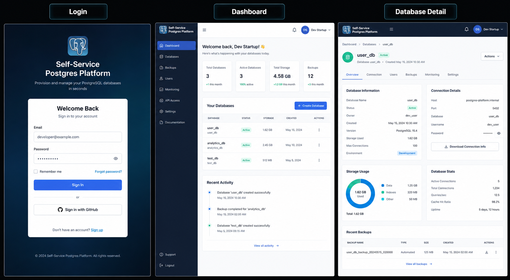

# 🐘 Self-Service PostgreSQL Platform

A full-stack platform that lets developers spin up their own isolated PostgreSQL databases on demand — no manual installation, no DBA required. Sign up, click **Create**, and get a ready-to-use connection string in seconds.

Built to demonstrate core **Platform Engineering** skills: infrastructure automation, containerization, API design, and cloud deployment.

**🔗 Live Demo:** [http://18.227.177.149/](http://YOUR_ELASTIC_IP)
**📦 Repository:** [github.com/ZubairSolanki/postgres-self-service-platform](https://github.com/ZubairSolanki/postgres-self-service-platform)

---

## 📸 Screenshots Simple modify productin p

| Login | Dashboard | Database Detail |
|---|---|---|


---

## ✨ Features

- **🔐 Authentication** — secure signup/login with JWT and bcrypt password hashing
- **⚡ One-click database provisioning** — creates a real, isolated PostgreSQL database and dedicated user automatically, named from the account owner
- **🗑️ Database lifecycle management** — list, delete (with soft-delete history), and manage owned databases
- **🔑 Password rotation** — reset a database's credentials instantly without losing any data
- **💾 Backup & restore** — full `pg_dump`/`pg_restore` support, timestamped backups, one-click restore
- **⬇️ Backup download** — export any backup as a portable `.sql` file
- **📊 Usage insights** — live database size and active connection count per database
- **📝 Audit logging** — every create, delete, backup, restore, and password reset is logged for traceability
- **🛡️ Strict ownership enforcement** — users can only ever see or modify their own databases, verified server-side on every request

---

## 🏗️ Architecture

```
┌─────────────┐        ┌──────────────┐        ┌─────────────────┐
│   React     │  REST  │   Express    │  SQL   │   PostgreSQL     │
│  (Nginx)    │ ─────► │   (Node.js)  │ ─────► │   (Docker)       │
│  Port 80    │        │  Port 4000   │        │   Port 5432      │
└─────────────┘        └──────────────┘        └─────────────────┘
                               │
                               ├── JWT auth middleware
                               ├── pg_dump / pg_restore (backups)
                               └── audit_logs (every action tracked)
```

All three services run as independent Docker containers, orchestrated with a single `docker-compose.yml`, and deployed on an AWS EC2 instance with a static Elastic IP.

---

## 🛠️ Tech Stack

**Frontend:** React, React Router, Tailwind CSS, Axios, Vite
**Backend:** Node.js, Express, node-postgres (`pg`), JWT, bcrypt
**Database:** PostgreSQL 16
**Infrastructure:** Docker, Docker Compose, Nginx, AWS EC2

---

## 🔒 Security Design

- Passwords hashed with **bcrypt** — raw passwords are never stored
- All protected routes require a valid **JWT**, verified server-side on every request
- User identity is always derived from the verified token, **never** trusted from request input
- Ownership checks run before every destructive action (delete, backup, restore, reset password)
- Database/user names are sanitized against a strict allow-list pattern before being used in raw SQL, preventing injection on identifiers that can't be parameterized
- Generated database credentials use random, high-entropy passwords
- Secrets (`.env`, JWT secret, DB credentials) are excluded from the Docker image and Git history

---

## 📂 Project Structure

```
postgres-self-service-platform/
├── docker-compose.yml
├── backend/
│   ├── Dockerfile
│   ├── db/schema.sql
│   └── src/
│       ├── index.js
│       ├── db.js
│       ├── middleware/authMiddleware.js
│       ├── routes/ (auth, databases, backups)
│       └── utils/sanitize.js
└── frontend/
    ├── Dockerfile
    └── src/
        ├── api/client.js
        ├── context/AuthContext.jsx
        ├── components/ProtectedRoute.jsx
        └── pages/ (Login, Signup, Dashboard, DatabaseDetail)
```

---

## 🚀 Running Locally

**Prerequisites:** Docker Desktop

```bash
git clone https://github.com/ZubairSolanki/postgres-self-service-platform.git
cd postgres-self-service-platform
docker compose up -d --build
```

This starts all three services — PostgreSQL, backend API, and frontend — with the database schema created automatically on first run.

| Service | URL |
|---|---|
| Frontend | http://localhost:5173 |
| Backend health check | http://localhost:4000/health |

---

## 📡 API Overview

| Method | Endpoint | Description |
|---|---|---|
| POST | `/api/auth/signup` | Create an account |
| POST | `/api/auth/login` | Log in, returns a JWT |
| POST | `/api/databases/create` | Provision a new database |
| GET | `/api/databases` | List your databases |
| GET | `/api/databases/:dbName/usage` | Database size & connection count |
| POST | `/api/databases/:dbName/reset-password` | Rotate database credentials |
| DELETE | `/api/databases/:dbName` | Delete a database |
| POST | `/api/backups/:dbName` | Create a backup |
| GET | `/api/backups/:dbName` | List backups |
| POST | `/api/backups/:dbName/restore/:fileName` | Restore from a backup |
| GET | `/api/backups/:dbName/download/:fileName` | Download a backup file |

All routes except signup/login require an `Authorization: Bearer <token>` header.

---

## ☁️ Deployment

Deployed on an **AWS EC2** instance (Ubuntu 24.04), running the full Docker Compose stack directly on the server, with a static **Elastic IP** so the public address never changes across restarts.

```bash
# On the server
git clone <repo>
cd postgres-self-service-platform
docker compose up -d --build
```

---

## 💡 What This Project Demonstrates

- Designing and provisioning real infrastructure (databases and roles) through an API, not just CRUD over static data
- Multi-container orchestration with Docker Compose, including health checks and service dependencies
- Secure-by-default API design: token-based identity, ownership enforcement, input sanitization for non-parameterizable SQL
- Operational database management: backup/restore workflows and credential rotation
- End-to-end cloud deployment: EC2 provisioning, security groups, and static IP configuration

---

## 👤 Author

**Zubair Solanki**
[GitHub](https://github.com/ZubairSolanki) · [LinkedIn](#)
